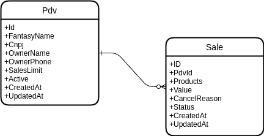

# Desafio Movilway

Para a realização deste teste foi escolhido o framework Laravel, instalação padrão, utilizando docker, phpunit e Php em sua versão 8.1.

## Requisitos
* Docker e Docker compose [instruções aqui](https://docs.docker.com/engine/install/ubuntu/#installation-methods);

## Instalação
1. Clone em sua máquina o projeto;
1. Acesse a pasta movilway `cd movilway`;
1. Execute `docker compose up -d --build` para criar os containers;
1. Execute `docker exec -ti movilway-laravel.test-1 composer install` para baixar os pacotes necessários;
1. Execute `./vendor/bin/sail composer dumpautoload` para carregar a lista de classes do projeto;
1. Execute `./vendor/bin/sail artisan migrate` para carregar as migrations que criam as tabelas no banco de dados;
1. Após o termino da instalação, teste se a aplicação está rodando assessando no navegador o endereço [localhost](http://localhost:80);

`Na pasta raiz do projeto há uma exportação de coleção do insomnia com todas as rotas configuradas para teste`

## Testes
Para executar os testes unitários e de integração, acesse a pasta movilway e execute `./vendor/bin/sail test`;

## Modelo Entidade-Relacionamento

